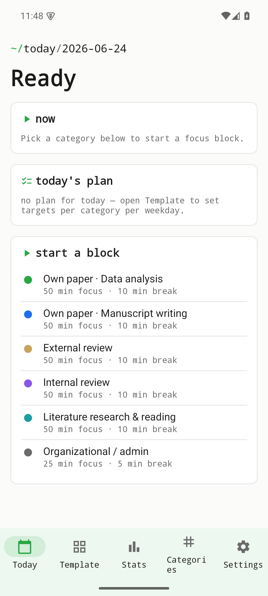
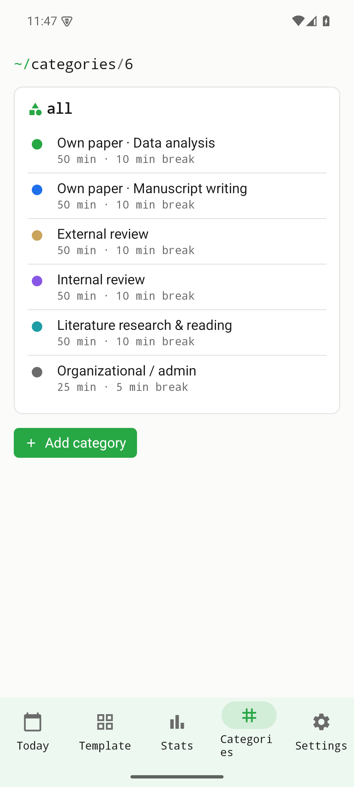

Une visite guidée d'Établi Focus v0.1.0, écran par écran. Chaque figure ci-dessous est une vraie capture d'écran de la version de développement v0.1.0 exécutée sur un émulateur Android. Focus est volontairement petit : définir des objectifs par catégorie et par jour de la semaine, lancer un bloc de concentration minuté, et voir ses statistiques s'accumuler au fil du temps — entièrement hors ligne, sans compte, sans télémétrie.

## Aujourd'hui

L'écran d'accueil s'ouvre sur **Aujourd'hui**. Il affiche la date du jour sous forme de fil d'Ariane façon terminal, une carte **maintenant** (ce qui tourne actuellement, ou une invitation à démarrer), le **plan du jour** (vos objectifs pour ce jour de la semaine) et une action **démarrer un bloc**. C'est le chemin le plus court vers une séance : tout ce qu'il faut pour commencer tient sur un seul écran.

{width=320}

## Démarrer un bloc de concentration

Toucher **démarrer un bloc** déploie le sélecteur de catégorie. Chaque catégorie porte ses propres durées de concentration et de pause (par exemple 50 min de concentration · 10 min de pause) ; il suffit donc d'en choisir une pour lancer une séance minutée — sans réglage supplémentaire au démarrage.

{width=320}

## Modèle — objectifs par jour de la semaine

**Modèle** est l'endroit où l'on définit les objectifs par catégorie et par jour de la semaine. Une fois un modèle en place, le « plan du jour » de l'écran Aujourd'hui se remplit automatiquement pour le jour correspondant, ce qui évite de tout replanifier chaque matin.

{width=320}

## Statistiques

**Statistiques** agrège votre temps de concentration accompli afin de visualiser l'effort par catégorie et dans le temps. Les blocs individuels deviennent une image de l'usage réel des heures.

{width=320}

## Catégories

**Catégories** gère les catégories de concentration elles-mêmes : chacune a un nom, une couleur et les durées de concentration et de pause par défaut utilisées au lancement d'un bloc. La couleur est reprise dans le sélecteur de démarrage, le plan et les statistiques, pour qu'une catégorie reste reconnaissable partout.

{width=320}

## Paramètres

**Paramètres** regroupe les préférences de l'appli, dont le thème (clair / sombre / système). On y retrouve aussi l'autorisation de notification qui signale la fin d'un bloc.

{width=320}

## Où l'obtenir

Établi Focus est **uniquement disponible sur Android** à ce stade et se présente sous la forme d'un APK de développement signé.

| Canal | Statut |
|-------|--------|
| Android (APK signé) | **Version de développement** — [version v0.1.0](https://github.com/etabli-dev/etabli-focus/releases/tag/v0.1.0) |
| Google Play | prévu — pas encore disponible |
| F-Droid | prévu — pas encore disponible |
| App Store (iOS) | prévu — pas encore disponible |
| Code source | [`etabli-dev/etabli-focus`](https://github.com/etabli-dev/etabli-focus) |

Pour l'installer : téléchargez `focus-0.1.0.apk` depuis la page de version, ouvrez-le sur votre appareil et autorisez les notifications (utilisées pour signaler la fin d'un bloc).
